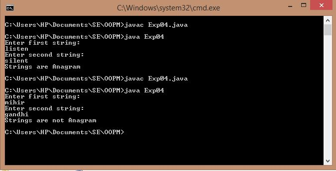
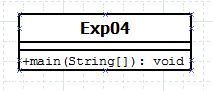

## Anagram

-----------------------------------------
### Problem Definition:
Write a program to check if two Strings are anagrams of each other. Two strings are said to be anagram if we can form one string by arranging the characters of another string. For example, <strong>RACE</strong> and <strong>CARE</strong>. 

------------------------------------------
### Output:

    

------------------------------------------
### Class Diagram:

 

