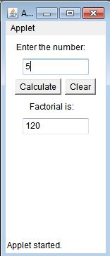
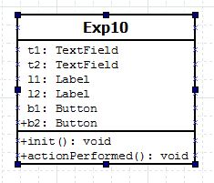

## Applet

-----------------------------------------
### Problem Definition:
Write a java applet program for calculating the factorial of a given number. 

------------------------------------------
### Output:

    

------------------------------------------
### Class Diagram:

 

