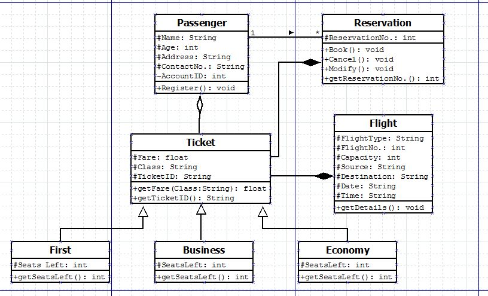

## Class Diagram - Case Study

-----------------------------------------
### Problem Definition:

Draw class Diagram for the Airline Reservation System. Clearly show attributes, multiplicities and aggregations/compositions/Association between classes in the class diagram. And show the implementation of aggregation, association and composition between the classes.

<strong>Consider an Airline reservation system. It contains the details of the passengers viz. name, age, address, contact number and account ID. The passengers need to book their ticket in advance. Each passenger has to register before making a reservation. When a reservation is made, a reservation number associated with it is generated . Ticket can be of three types: First class, Business class or Economic class. Each class has a limited number of seats, out of which some may be booked. So, each class should have the number of seats left in it at any given time. Flights are of different types. Every flight has a unique number, fixed capacity, source, destination, departure date and time. Tickets for the same flight have varying fare depending on the class. Further, each ticket has a unique ID. There can be many people travelling in one flight. The user can book , cancel, or modify the ticket and can also get the reservation number.<strong>

------------------------------------------
### Class Diagram:

 

