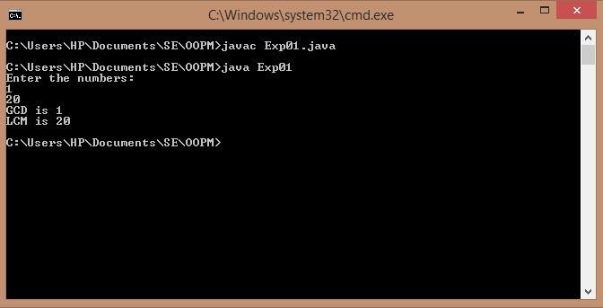
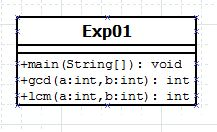

## GCD and LCM

-----------------------------------------
### Problem Definition:
Write recursive functions to find the <strong>GCD</strong> and  <strong>LCM</strong> of the given two numbers.

------------------------------------------
### Output:

    

------------------------------------------
### Class Diagram:

 

