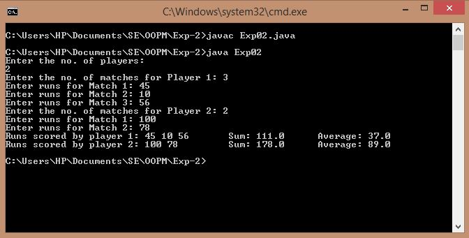
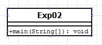

## Multidimensional Array

-----------------------------------------
### Problem Definition:
Write a program which stores information about n players in a two dimensional array. The array should contain number of rows equal to number of players. Each row will have number of columns equal to number of matches played by that player which may vary from player to player. The program should display player number (index +1), runs scored in all matches and its batting average as output. It is expected to assign columns to each row dynamically after getting value from user.

------------------------------------------
### Output:

    

------------------------------------------
### Class Diagram:

 

