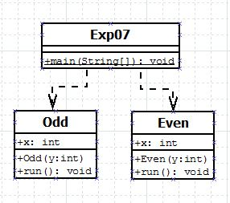

## Multithreading

-----------------------------------------
### Problem Definition:
Write a program to take a random number as input and print its square if it is even and cube if it is odd by creating 2 threads. 

------------------------------------------
### Output:

    

------------------------------------------
### Class Diagram:

 

