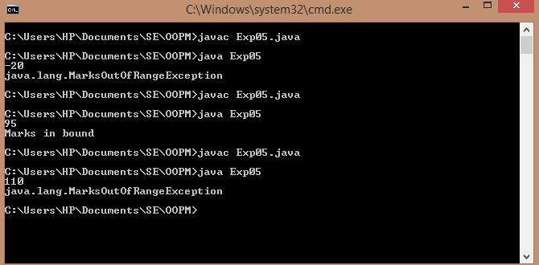

## User-defined Exception

-----------------------------------------
### Problem Definition:
Write a program which accepts marks of a student (between 0 to 100) and checks whether it is within the range or not. If it is within the range then it displays “marks entered successfully”, if not then it throws the exception of user defined class “MarksOutOfRangeException”. The class should contain appropriate toString method to describe object the class with the out of range marks entered by the user.

------------------------------------------
### Output:

    

------------------------------------------
### Class Diagram:

 

