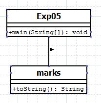

## User-defined Package

-----------------------------------------
### Problem Definition:
Write a program to create a package *myPack* which contains a class *Trigonometry*. The class contains following static methods:
1. sine() – accepts degree (0,30,60,90)
2. cos() - accepts degree (0,30,60,90)
3. tan() - accepts degree (0,30,60,90)
4. cot() - accepts degree (0,30,60,90)
5. cosec() - accepts degree (0,30,60,90)
6. sec() - accepts degree (0,30,60,90)

Use the functions of user defined class *Trigonometry* by importing the package *mypack*.

------------------------------------------
### Output:

    

    

------------------------------------------
### Class Diagram:

 

