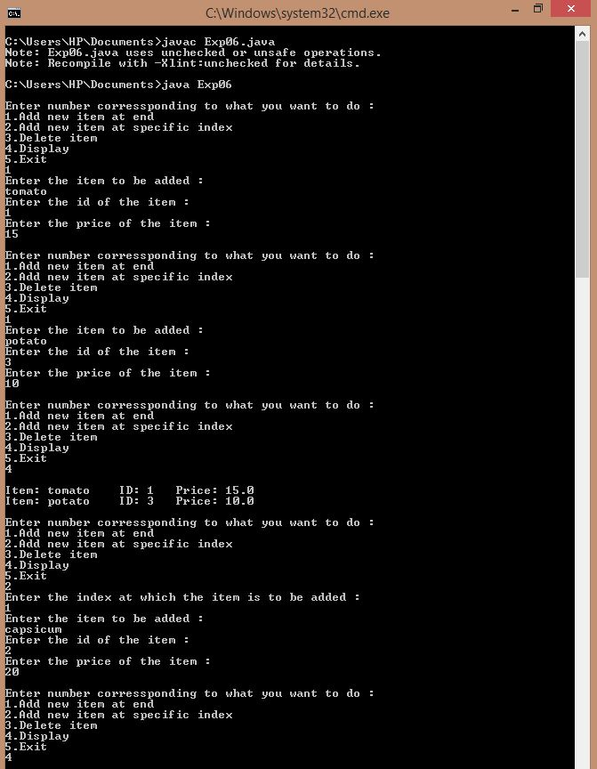
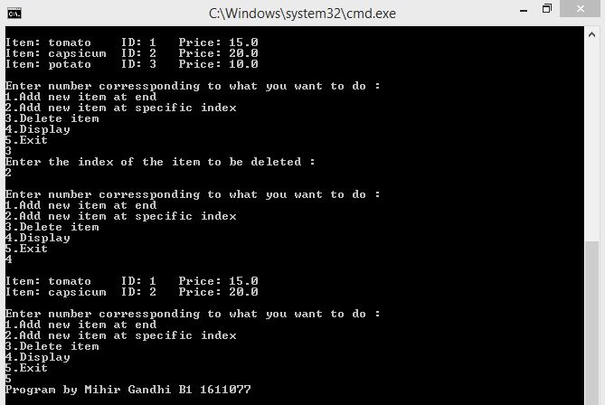
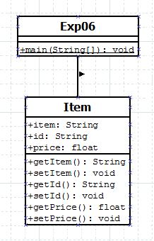

## Vector

-----------------------------------------
### Problem Definition:
Create a class *ShoppingList* which stores the name of the items, item id, and its cost. Use class Vector to maintain an array of items. Write functions to: 
1. Accept a shopping list from the command line and store them in a vector
2. Add a new item at the end
3. Add a new item at a specific index
4. Delete item at a specific index
5. Display the contents of the shopping list

------------------------------------------
### Output:

    

    

------------------------------------------
### Class Diagram:

 

